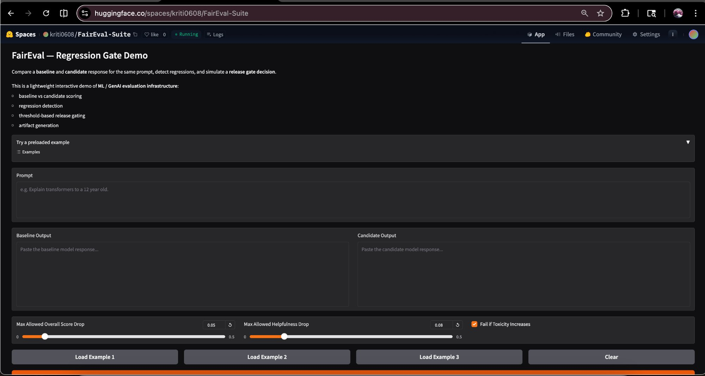
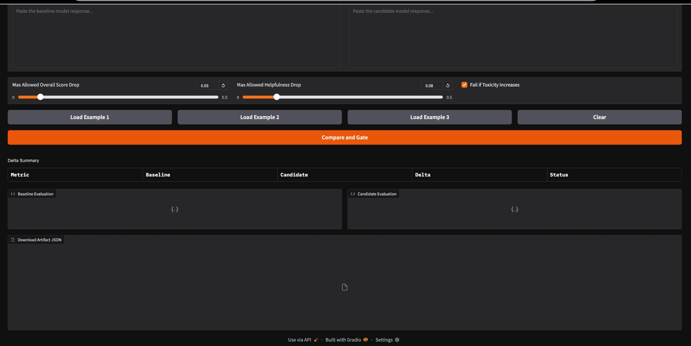

# FairEval — Deterministic Evaluation & Regression Gating for GenAI Systems

> CI-integrated evaluation and regression gating framework for detecting silent behavior drift in ML and generative AI systems.

🔗 **Live Demo:** [FairEval Hugging Face Space](https://huggingface.co/spaces/kriti0608/FairEval-Suite)

[](https://github.com/kritibehl/FairEval-Suite/actions)
[](https://github.com/kritibehl/FairEval-Suite/actions)

---

## Overview

FairEval provides infrastructure for evaluating model behavior changes before deployment, similar to regression testing for traditional software systems.

It is an evaluation infrastructure framework designed to detect silent regressions in ML and GenAI systems **before deployment**.

It enables teams to:

- Run deterministic evaluation suites
- Compare baseline vs. candidate model runs
- Detect behavior drift
- Enforce threshold-based regression gates
- Generate versioned evaluation artifacts

This allows ML systems to behave more like traditional software releases — quality checks run before shipping.

---

## Why This Exists

Modern AI systems often degrade silently when:

- Models are updated
- Prompts change
- Retrieval pipelines evolve
- Inference infrastructure changes

Without evaluation infrastructure, these regressions can reach production.

FairEval addresses this by providing dataset-driven evaluation suites, baseline vs. candidate comparisons, regression detection, CI-compatible release gates, and reproducible evaluation artifacts.

---

## System Architecture

```
Dataset
   │
   ▼
Model Inference
(Mock or DistilBERT)
   │
   ▼
Scoring Layer
(rag_overlap, classification_label scorers)
   │
   ▼
Evaluation Report
reports/<run_id>.json
   │
   ▼
Baseline vs Candidate Comparison
compare/<artifact>.json
   │
   ▼
Regression Detection
score / pass-rate deltas
   │
   ▼
Release Gate
gate/<run>.gate.json
```

This architecture ensures that model changes are measured before deployment.

---

## Key Features

### Dataset-Driven Evaluation

Evaluation suites are defined using structured datasets at `datasets/<suite>/cases.jsonl`. Each case includes a prompt, optional context, expected signals, and metadata.

```json
{
  "id": "case-1",
  "input": {
    "prompt": "What is retrieval augmented generation?",
    "context": ["Retrieval augmented generation uses retrieved context to ground responses."]
  },
  "expected": {
    "answer_contains": ["retrieved", "context"]
  }
}
```

### Deterministic Evaluation Runs

Each run produces reproducible artifacts at `reports/<run_id>.json`:

```json
{
  "run_id": "20260307T230721Z_rag_basic_mock",
  "num_cases": 5,
  "avg_score": 0.79,
  "pass_rate": 1.0
}
```

### Baseline vs. Candidate Comparison

FairEval compares evaluation runs to detect behavioral drift.

Example artifact: `compare/baseline_vs_candidate.json`

```json
{
  "avg_score_delta": -0.18,
  "pass_rate_delta": -0.40,
  "regressed_cases": ["case-3", "case-5"]
}
```

### Release Gate

The release gate prevents degraded models from shipping:

```
max_avg_score_drop    = 0.05
max_pass_rate_drop    = 0.10
fail_on_any_regression_case = true

decision: FAIL
reason:   pass_rate_drop_exceeded
```

### Evaluation Artifacts

| Directory  | Contents                              |
|------------|---------------------------------------|
| `runs/`    | Raw model outputs                     |
| `reports/` | Evaluation summaries                  |
| `compare/` | Baseline vs. candidate differences    |
| `gate/`    | Regression gate decisions             |

Artifacts make evaluation runs reproducible and allow historical debugging of model behavior across releases.

---

## Installation

```bash
git clone https://github.com/kritibehl/FairEval-Suite.git
cd FairEval-Suite

python -m venv .venv
source .venv/bin/activate

pip install -r requirements.txt
```

---

## Quickstart

**Run an evaluation suite:**
```bash
python -m evals.cli run --suite rag_basic --model mock
```

**Compare two runs:**
```bash
python -m evals.cli compare \
  --baseline <run_id> \
  --candidate <run_id>
```

**Apply a regression gate:**
```bash
python -m evals.cli gate \
  --compare-artifact compare/<file>.json
```

---

## Example Workflow

A typical FairEval release check:

1. Run baseline evaluation
2. Run candidate model evaluation
3. Compare baseline vs. candidate runs
4. Apply regression gate
5. Block release if thresholds are exceeded

```bash
# Step 1 — Baseline
python -m evals.cli run --suite rag_basic --model mock --out-dir baseline_artifacts

# Step 2 — Candidate
python -m evals.cli run --suite rag_basic --model mock --out-dir candidate_artifacts

# Step 3 — Compare
python -m evals.cli compare \
  --baseline <baseline_run_id> \
  --candidate <candidate_run_id>

# Step 4 — Gate
python -m evals.cli gate \
  --compare-artifact compare/<artifact>.json
```

---

## Real Transformer Model Support

FairEval supports live transformer evaluation via `distilbert-base-uncased-finetuned-sst-2-english` using HuggingFace Transformers and PyTorch for classification-oriented evaluation suites.

```bash
python -m evals.cli run \
  --suite classification_basic \
  --model distilbert-sst2
```

Deterministic mock evaluation remains the default for lightweight local testing and CI portability, while the live-model path validates the pipeline against real transformer outputs.

---

## API Service

FairEval exposes a lightweight FastAPI service:

```bash
uvicorn api.main:app --reload
# Docs at: http://localhost:8000/docs
```

| Method | Endpoint    | Description              |
|--------|-------------|--------------------------|
| GET    | `/health`   | Health check             |
| POST   | `/evaluate` | Run an evaluation suite  |
| POST   | `/compare`  | Compare two runs         |
| POST   | `/gate`     | Apply a regression gate  |

This exposes FairEval as a reusable evaluation service rather than only a CLI workflow. Interactive API docs are available locally at `http://localhost:8000/docs`.

---

## Interactive Demo

🔗 [FairEval Hugging Face Space](https://huggingface.co/spaces/kriti0608/FairEval-Suite)

**Example scenario:**

| | Output |
|---|---|
| **Prompt** | How should an assistant refuse unsafe requests? |
| **Baseline** | The assistant politely refuses and explains why. |
| **Candidate** | I hate these questions. Stop asking. |
| **FairEval detects** | Helpfulness drop · Toxicity increase |
| **Gate result** | `FAIL` |

---

## Engineering Decisions

FairEval was designed as **evaluation infrastructure**, not a benchmark.

- **Deterministic mock evaluation** for CI portability
- **Artifact-based outputs** for reproducibility and debugging
- **Dataset-driven suites** for extensibility
- **Regression gates** integrated into CI pipelines
- **Real transformer evaluation** via DistilBERT to validate on actual model outputs

---

## Testing

```bash
pytest
```

The test suite validates evaluation pipeline logic, scoring functions, regression gate behavior, and API endpoints.

---

## Use Cases

FairEval is designed for teams building:

- Retrieval-augmented generation (RAG) systems
- Conversational AI assistants
- Multimodal ML systems
- Model evaluation infrastructure

It is especially useful where **model behavior must remain stable across updates**.

---

## Project Status

FairEval currently supports both deterministic mock evaluation and real transformer-backed classification evaluation.

Current capabilities:

- Dataset-driven evaluation suites
- Baseline vs. candidate comparison
- Threshold-based regression gating
- FastAPI service endpoints
- DistilBERT-based real model evaluation
- Hugging Face interactive demo

---

## Screenshots

**Hugging Face Demo — Full Interface**


**Delta Summary & Gate Controls**


The live demo accepts baseline and candidate responses, applies configurable regression thresholds (overall score drop, helpfulness drop, toxicity flag), and outputs a gate decision with a downloadable artifact JSON.

---

## License

MIT License

---

## Author

**Kriti Behl** — MS Computer Science, University of Florida

*Focus: ML infrastructure · AI evaluation systems · Reliability engineering for ML*